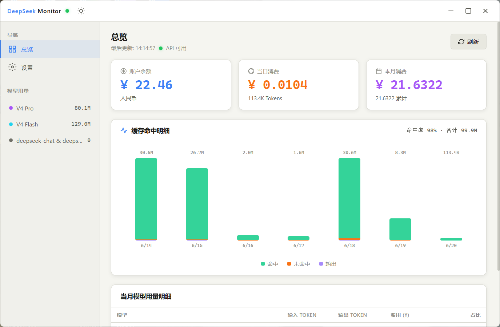
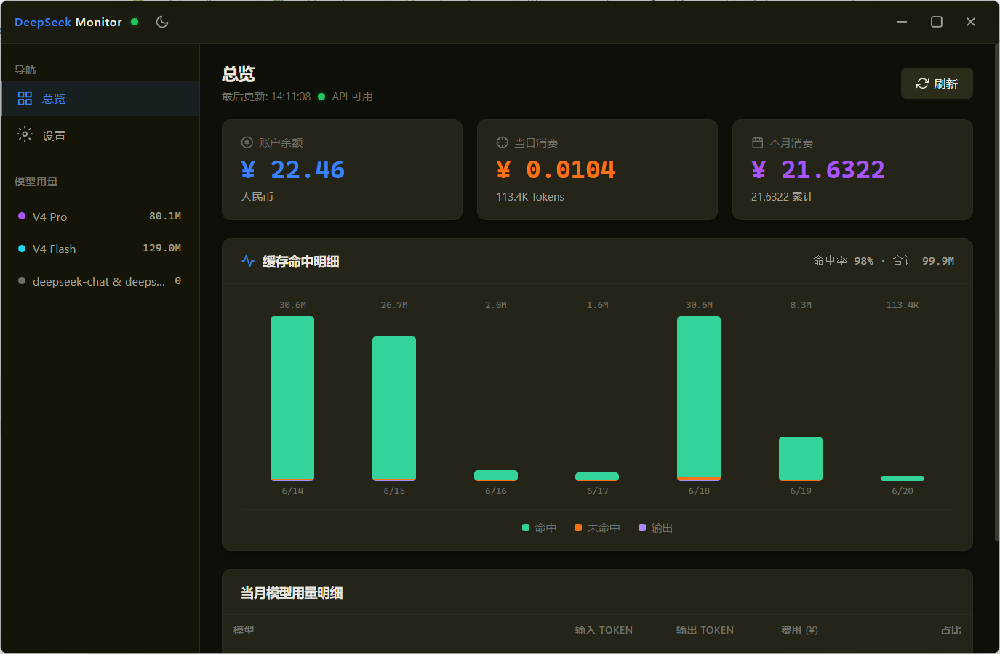
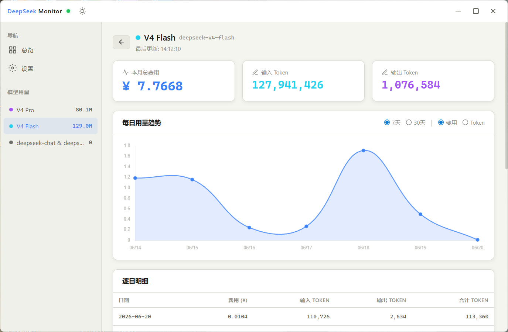
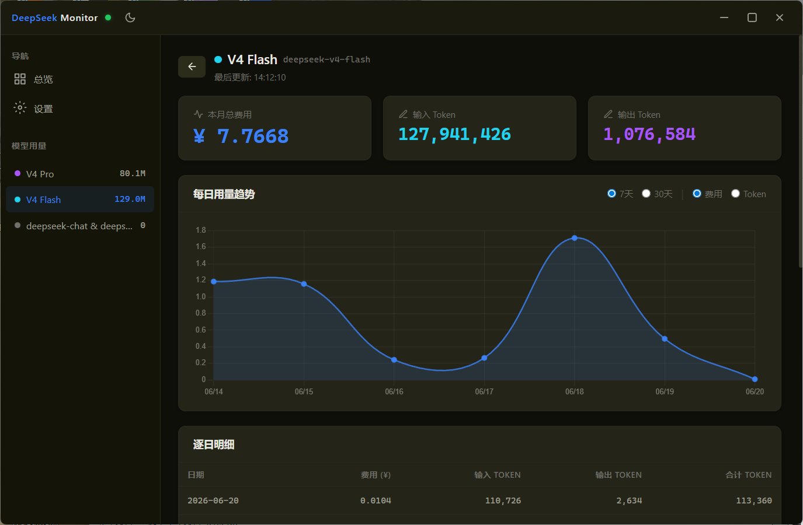
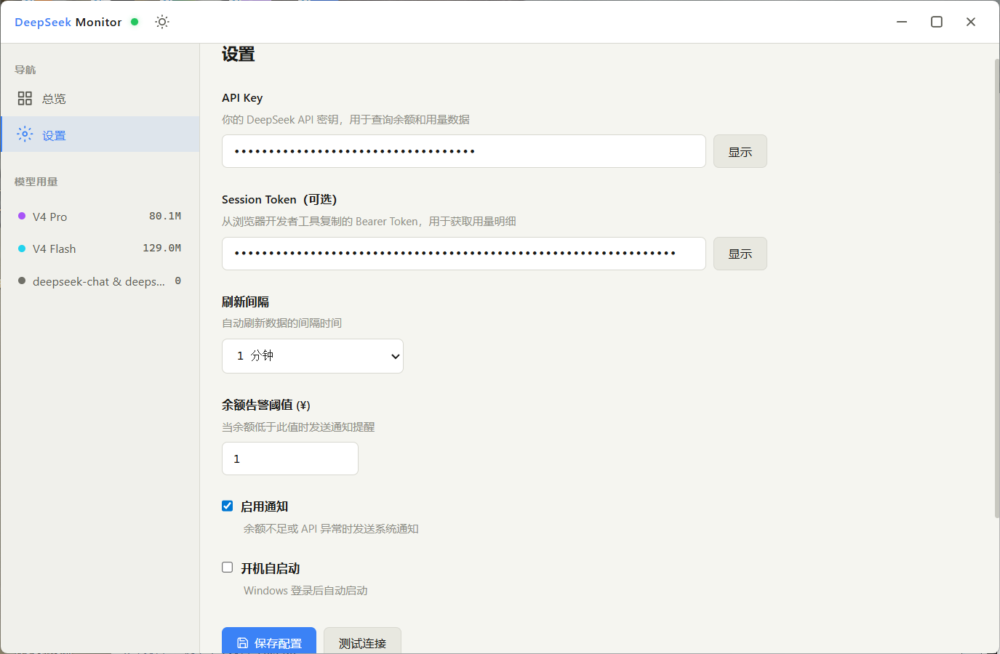
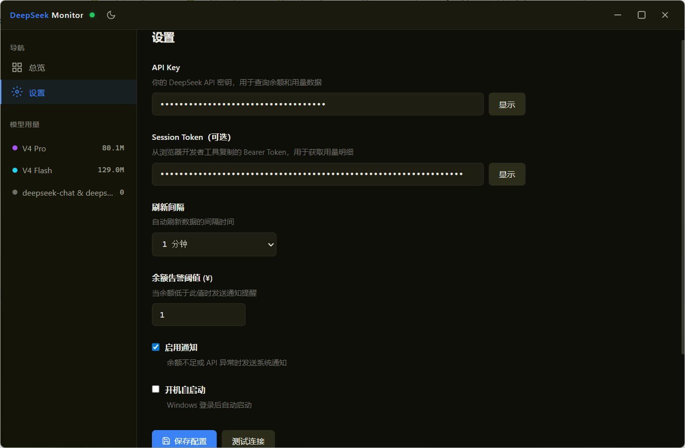

# DeepSeek Monitor

[中文](README.md) | [English](README.en.md)

DeepSeek API usage & balance monitoring Windows desktop gadget, supports collapsing to system tray.  
Built with Electron + Vue 3, queries balance via API Key, and retrieves detailed data such as cache hit rate and model usage breakdown via Session Token (optional).

## Tech Stack

| Layer | Technology |
|---|---|
| Desktop Framework | [Electron](https://www.electronjs.org/) |
| Frontend Framework | [Vue 3](https://vuejs.org/) |
| Frontend Router | [Vue Router](https://router.vuejs.org/) |
| Backend | [Node.js](https://nodejs.org/) |
| Data Visualization | [Chart.js](https://www.chartjs.org/) + [vue-chartjs](https://vue-chartjs.org/) |
| Build | [Vite](https://vitejs.dev/) + [electron-builder](https://www.electron.build/) |

## Project Structure

```
deepseek-monitor-electron/
├── src/
│   ├── main/                 # Electron main process
│   │   ├── index.js          # App entry, system tray
│   │   ├── window.js         # Window creation & management
│   │   ├── ipc.js            # IPC handler
│   │   ├── api.js            # DeepSeek API client
│   │   └── config.js         # Config file read/write
│   ├── preload/              # Preload script (contextBridge)
│   │   └── index.js          # Expose API / window controls / Electron API
│   └── renderer/             # Vue renderer process
│       ├── index.html        # HTML entry
│       └── src/
│           ├── main.js       # Vue app entry
│           ├── App.vue       # Root component
│           ├── assets/
│           │   └── main.css  # Global styles
│           ├── views/        # Page views
│           │   ├── Dashboard.vue    # Dashboard overview
│           │   ├── ModelDetail.vue  # Model usage details
│           │   └── Settings.vue     # Settings page
│           ├── components/   # Components
│           │   ├── TopBar.vue        # Top title bar + window controls
│           │   ├── SideBar.vue       # Side navigation
│           │   ├── MetricCard.vue    # Metric card
│           │   ├── UsageChart.vue    # Usage trend chart
│           │   ├── CacheChart.vue    # Cache analysis chart
│           │   └── ModelBreakdown.vue # Model breakdown
│           ├── stores/       # State management
│           │   └── api.js    # Reactive state + API calls
│           ├── composables/  # Composable functions
│           │   └── useTheme.js  # Theme switching
│           └── router/       # Routing
│               └── index.js
├── build/                    # Build config (icons, macOS entitlements)
│   └── icon_source/          # Icon source files (SVG, conversion scripts)
├── resources/                # App icons
├── images/                   # Screenshots
├── release-documents/        # Release notes
├── electron.vite.config.mjs  # Vite config
├── electron-builder.yml      # Packaging config
├── eslint.config.mjs         # ESLint config
├── .editorconfig             # Editor config
├── .prettierrc.yaml          # Prettier config
├── LICENSE
└── package.json
```

## How to Run

```bash
# Development mode (hot reload)
cd deepseek-monitor-electron
npm install
npm run dev

# Package as Windows installer
npm run build:win

# macOS
npm run build:mac

# Linux (AppImage / snap / deb)
npm run build:linux
```

## Core Features

| Feature | Implementation |
|---|---|
| Balance Query | Total balance / gift / top-up / currency |
| Cache Hit Details | Stacked bar chart for last 7 days: cache hit/miss/output |
| Model Usage Breakdown | Auto-identify and aggregate cost & token consumption per model (DeepSeek V4 Flash/Pro, DeepSeek Chat, DeepSeek Reasoner, etc.) |
| Today's Consumption | Extract today's cost + token count from cache usage details |
| Monthly Consumption | Aggregate monthly total cost from platform API |
| System Tray | Left-click toggle show/hide / right-click menu (Show / Refresh Data / Settings / Quit) |
| Custom Window Title Bar | Frameless window with custom minimize/maximize/close buttons |
| Auto Refresh | Frontend timer (default 60s, adjustable in settings) |
| Balance Alert | Windows system notification when balance falls below threshold |
| API Diagnostics | Built-in diagnostic tool that probes all available endpoints and returns raw responses |
| Auto-start on Boot | Optional auto-launch after Windows login |
| Theme Switching | Dark / Light theme support |

## Configuration

The application requires the following credentials to connect to the DeepSeek API:

| Config | Description | Required |
|--------|-------------|----------|
| **API Key** | DeepSeek API key, used to query balance | ✅ Yes |
| **Session Token** | Bearer Token copied from browser DevTools, used to retrieve usage details and cache data | ❌ Optional (recommended for more accurate usage data) |

## DeepSeek API Integration

### Balance Endpoint (requires API Key)

| Endpoint | Purpose |
|---|---|
| `GET /user/balance` | Query balance (¥), including gift balance and top-up balance |

### Usage Endpoints (requires API Key + Session Token)

The client automatically tries multiple URL patterns and deserialization strategies to adapt to API changes:

| Endpoint Type | Purpose |
|---|---|
| `api.deepseek.com/dashboard/billing/usage` | OpenAI-compatible usage API |
| `platform.deepseek.com/api/v0/usage/amount` | Platform usage API (cache hit/miss tokens) |
| `platform.deepseek.com/api/v0/usage/cost` | Platform cost API (per-model breakdown) |
| 10 additional fallback paths | Auto-detection for compatibility |

API Base URL: `https://api.deepseek.com`  
Platform URL: `https://platform.deepseek.com`

## Screenshots

*Overview page: account balance, today's consumption, monthly consumption, cache hit details, and model usage breakdown*
 

*Model usage details page: input/output tokens, cost, and percentage per model*
 

*Settings page: API Key, Session Token, refresh interval, balance alert threshold, notification and auto-start toggles*
 

## Usage Instructions

1. After launching the app, click "Settings" in the left navigation
2. Enter your DeepSeek API Key on the settings page
3. (Optional) Copy `Authorization: Bearer xxx` from a Network request on the DeepSeek website in your browser and paste it as the Session Token to retrieve detailed usage data such as cache hit rate
4. Click "Test Connection" to verify the API Key
5. Click "Save Configuration" — data will auto-refresh and display on the dashboard
6. Click the "—" button in the top-right corner to collapse the window to the system tray
7. Right-click the system tray icon to bring up the menu (Refresh Data / Settings / Quit)
8. Left-click the tray icon to toggle window visibility
9. If usage data is empty, use the "API Diagnostics" tool on the settings page to troubleshoot endpoint status

## UI Color Scheme (Dark Theme)

| Usage | Color |
|---|---|
| Background | `#0f0f0a` / `#1a1a0e` |
| Card | `#242418` |
| Blue Primary (Balance) | `#3b82f6` |
| Orange (Today's Consumption) | `#f97316` |
| Purple (Monthly Consumption / V4 Pro) | `#a855f7` |
| Cyan (Cache Hit / V4 Flash) | `#22d3ee` |
| Green (Cache Miss) | `#22c55e` |
| Yellow (Output Token) | `#eab308` |
| Red (Low Balance Warning) | `#ef4444` |

## Known Limitations

The following features have their UI and settings storage ready, but the backend logic is still in progress:

| Feature | Description |
|---------|-------------|
| **Balance Alert** | Alert threshold is saved to config, but Windows system notification is not yet wired up **(Fixed)** |
| **Auto Refresh Interval** | Refresh interval can be adjusted in settings (30s–10min), but the timer is currently hardcoded to 60 seconds **(Fixed)** |
| **Auto-start on Boot** | Auto-start toggle is saved, but has not been registered with Windows login items yet **(Fixed)** |
